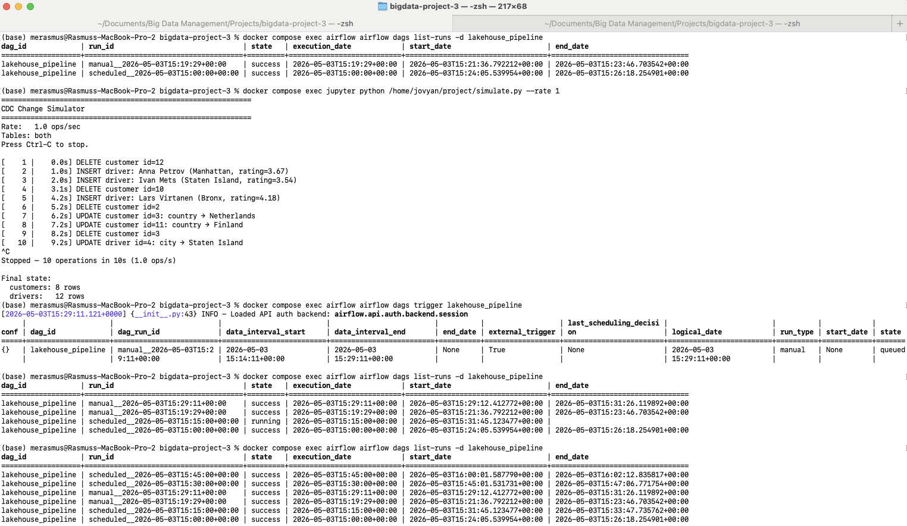
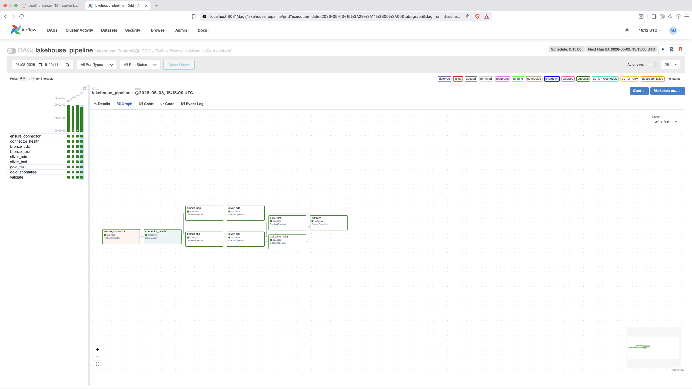

# Project 3 — CDC & Orchestrated Lakehouse Pipeline

**Group E** | PostgreSQL CDC → Debezium → Kafka → Iceberg + Taxi Pipeline, orchestrated with Apache Airflow.

## 1. CDC Correctness

### PostgreSQL → Silver Current-State Mirror

The CDC path captures changes from PostgreSQL tables `public.customers` and `public.drivers` using Debezium and writes them through Kafka into Iceberg Bronze and Silver tables.

After running `simulate.py` for fresh mutations and triggering the full DAG again, the final validation task compared Silver row counts against PostgreSQL. The simulator was stopped before validation so PostgreSQL would not continue changing during the comparison.

| Table | Silver (Iceberg) | PostgreSQL | Drift |
|---|---:|---:|---:|
| `silver_customers` | 8 | 8 | 0 |
| `silver_drivers` | 12 | 12 | 0 |

The validation task fails if any row-count drift remains.

### Live CDC Events and Deletes

Bronze CDC stores all Debezium events append-only, including the initial snapshot, live changes, and tombstones.

| Table | `r` snapshot | `c` inserts | `u` updates | `d` deletes | Tombstones |
|---|---:|---:|---:|---:|---:|
| `bronze_customers` | 10 | 2 | 6 | 4 | 4 |
| `bronze_drivers` | 8 | 4 | 4 | 0 | 0 |

For deletes, Debezium emits an `op = 'd'` event followed by a null-value tombstone. Bronze stores both. Silver uses the delete event in the MERGE logic:

```sql
WHEN MATCHED AND s.op = 'd' THEN DELETE
```

Tombstones are ignored by Silver because they have `op IS NULL`. Deleted PostgreSQL rows were confirmed absent from `silver_customers`.

### MERGE Idempotency

`bronze_cdc` reads Kafka from `max(kafka_offset) + 1` per partition, so reruns with no new messages append no duplicate Bronze rows. `silver_cdc` deduplicates Bronze by primary key using the latest `(ts_ms, kafka_offset)` and then applies MERGE:

- `op = 'd'` deletes matched rows.
- `op IN ('c','u','r')` updates matched rows or inserts new ones.
- Reapplying the same latest state leaves Silver unchanged.

Consecutive DAG runs with no new source changes produced the same Silver state and validation passed with zero drift.

## 2. Lakehouse Design

### CDC Tables

`cdc.bronze_customers` and `cdc.bronze_drivers` preserve the raw CDC event log: Kafka offset, partition, timestamp, Debezium operation, before/after fields, `source_lsn`, and `ts_ms`. Bronze is append-only and stores tombstones as `event_type = 'tombstone'`.

`cdc.silver_customers` stores the current customer state:

```text
id, name, email, country, last_updated_ms
```

`cdc.silver_drivers` stores the current driver state:

```text
id, name, license_number, city, rating, active, last_updated_ms
```

The `active` field is included because the simulator toggles driver activity status. Driver `rating` is decoded from Debezium’s encoded decimal representation in Silver.

### Taxi Tables

`taxi.bronze_trips` stores raw Kafka taxi JSON events with Kafka metadata:

```text
key, value, topic, partition, offset, timestamp
```

`taxi.silver_trips` parses and cleans trips, casts timestamps/numeric fields, removes invalid records, and enriches rows with pickup/dropoff zone names from `taxi_zone_lookup.parquet`. It is partitioned by `days(tpep_pickup_datetime)`.

`taxi.gold_route_stats` aggregates clean Silver trips by `(pickup_borough, dropoff_borough)`:

```text
trip_count, total_revenue, avg_distance, revenue_per_mile
```

For the custom scenario, `taxi.silver_trip_custom_scenario` keeps suspicious-but-parseable trips that normal `silver_trips` would remove. The anomaly Gold tables derive from this review table.

### Iceberg Snapshots and Time Travel

Each CDC MERGE creates a new Iceberg snapshot. Snapshot history was inspected with:

```sql
SELECT snapshot_id, committed_at, operation
FROM lakehouse.cdc.silver_customers.snapshots
ORDER BY committed_at;
```

A previous state can be queried with:

```sql
SELECT *
FROM lakehouse.cdc.silver_customers VERSION AS OF <snapshot_id>;
```

A bad MERGE can be rolled back with:

```sql
CALL lakehouse.system.rollback_to_snapshot('cdc.silver_customers', <snapshot_id>);
```

## 3. Orchestration Design

The whole pipeline is coordinated by one Airflow DAG.

```text
ensure_connector → connector_health ─┬─ bronze_cdc  → silver_cdc ─────────────────────────────┐
                                      └─ bronze_taxi → silver_taxi ─┬─ gold_taxi ───────────────┤
                                                                     └─ gold_anomalies ─────────┴─→ validate
```

| Task | Purpose |
|---|---|
| `ensure_connector` | Create Debezium connector if missing |
| `connector_health` | Check Debezium connector status before processing |
| `bronze_cdc` | Load new CDC Kafka events into Bronze |
| `silver_cdc` | MERGE CDC Bronze into current-state Silver |
| `bronze_taxi` | Load new taxi Kafka events into Bronze |
| `silver_taxi` | Clean/enrich taxi trips and create custom-scenario review Silver |
| `gold_taxi` | Build route-level taxi aggregation |
| `gold_anomalies` | Build custom anomaly Gold tables |
| `validate` | Compare Silver CDC row counts with PostgreSQL |

The DAG runs every 15 minutes, giving a 15-minute freshness SLA for analytics. `max_active_runs=1` prevents overlapping MERGE operations.

Retries are configured with exponential backoff:

```python
retries = 3
retry_delay = 1 minute
max_retry_delay = 10 minutes
sla = 30 minutes
```

If `connector_health` cannot confirm the Debezium connector is running before timeout, the sensor soft-fails and is marked as skipped. Downstream tasks are skipped rather than running against an unhealthy CDC source. Once Connect recovers, the next scheduled or manually triggered run can proceed normally.

The run history shows multiple consecutive successful full DAG runs, including both manual and scheduled executions. One manual run was triggered after fresh PostgreSQL mutations from `simulate.py`; it completed successfully, and `validate` passed with exact PostgreSQL/Silver row-count equality.



The graph-view screenshot below shows the full DAG with all tasks visible and completed successfully.



## 4. Taxi Pipeline

The taxi path continues the Project 2 medallion pipeline, now orchestrated by Airflow:

```text
produce.py → Kafka taxi-trips → bronze_trips → silver_trips → gold_route_stats
```

Bronze is incremental: `bronze_taxi` computes Kafka `startingOffsets` from the maximum offset already stored in `bronze_trips`, so reruns do not append duplicate events.

Silver removes invalid trips, joins zone names, and deduplicates trips by:

```text
VendorID, pickup timestamp, dropoff timestamp, PULocationID, DOLocationID
```

Gold aggregates borough-to-borough route statistics.

Improvements over Project 2:

1. The taxi pipeline is now executed by Airflow instead of standalone notebook/streaming jobs.
2. Bronze ingestion is idempotent through offset-based incremental reads.
3. The pipeline adds a custom anomaly-analysis branch while keeping the normal cleaned Silver table intact.


## 5. Custom Scenario

The custom GitHub issue required a `gold_trip_anomalies` table for a fraud review team. A trip is anomalous if any rule applies:

- distance is 0 and fare is greater than $10,
- duration is below 1 minute and distance is greater than 5 miles,
- tip is more than 100% of the fare,
- fare is negative,
- trip crosses midnight and fare is below $5.

Because normal `silver_trips` removes some of these suspicious records, the implementation adds `silver_trip_custom_scenario`. It parses, casts, and enriches taxi events but preserves suspicious records needed by the anomaly rules.

The custom scenario produces:

| Table | Purpose |
|---|---|
| `gold_trip_anomalies` | Flagged trips with triggered rules and severity |
| `gold_anomaly_summary` | Daily anomaly totals and rule counts |
| `gold_anomalies_by_zone` | Pickup-zone anomaly concentration |

Severity is based on rule count: 1 = low, 2 = medium, 3+ = high.

After the DAG run:

| Table | Rows |
|---|---:|
| `gold_trip_anomalies` | 7 |
| `gold_anomaly_summary` | 1 |
| `gold_anomalies_by_zone` | 51 |

Detected rules:

| Rule | Severity | Count |
|---|---|---:|
| `negative_fare` | low | 6 |
| `zero_dist_high_fare` | low | 1 |

The zone query showed anomalies concentrated in several Manhattan pickup zones, including Kips Bay, Midtown Center, East Village, and Lower East Side.